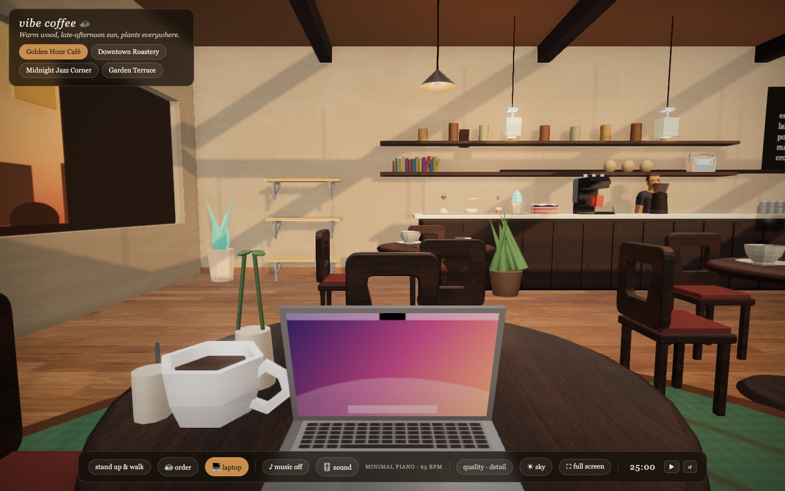
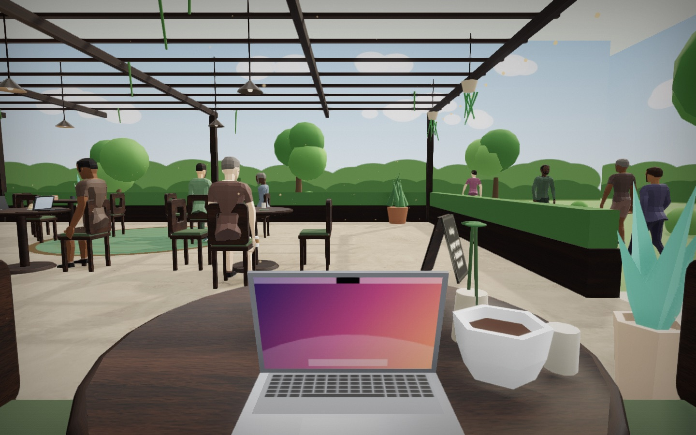

# vibe coffee ☕

Your own quiet corner of the internet.



<table>
  <tr>
    <td></td>
    <td></td>
  </tr>
</table>

## Start the server

```bash
npm install
npm start
```

Open [http://127.0.0.1:5173](http://127.0.0.1:5173).
