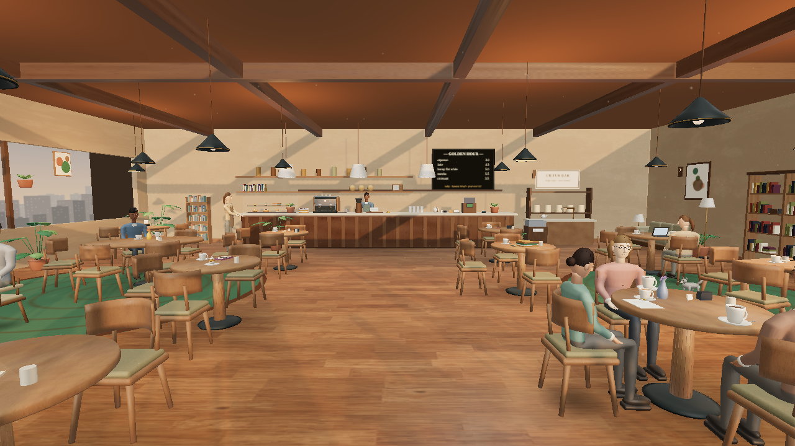
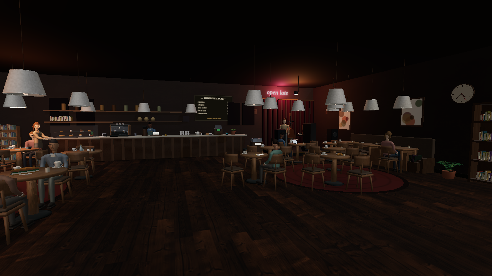
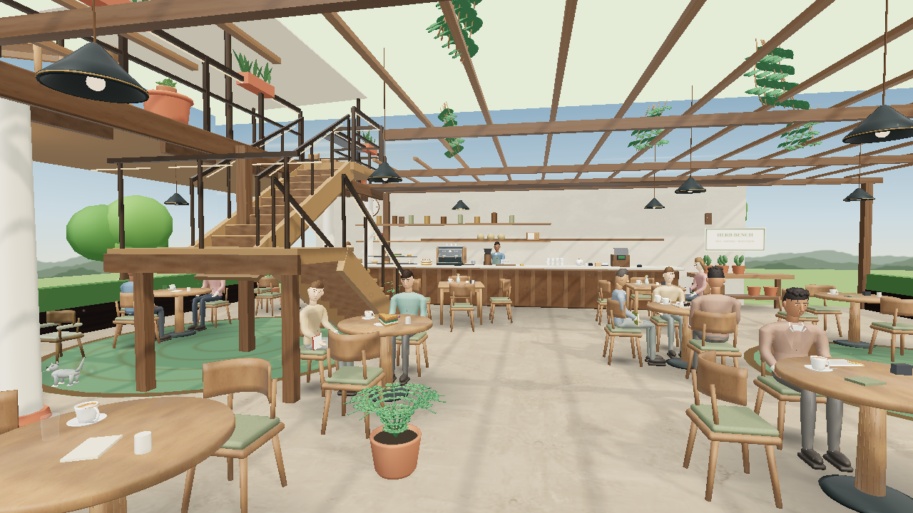

# vibe coffee ☕

Your own quiet corner of the internet.



<table>
  <tr>
    <td></td>
    <td></td>
  </tr>
</table>

## Start the server

```bash
npm install
npm start
```

Open [http://127.0.0.1:5173](http://127.0.0.1:5173).

See the [Blender rebuild](docs/rebuild/README.md) for current screenshots, the
movement video, and validation. The [asset guide](assets/blender/README.md)
contains editable models and regeneration instructions. Earlier graphics work
is archived in [docs/graphics](docs/graphics/README.md).

See the [NPC movement notes](docs/motion/README.md) for smoothing changes and
the reproducible browser motion audit.
